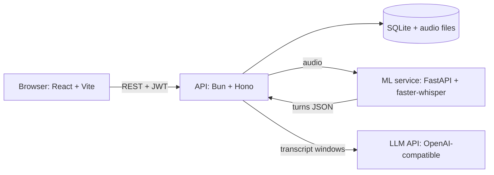
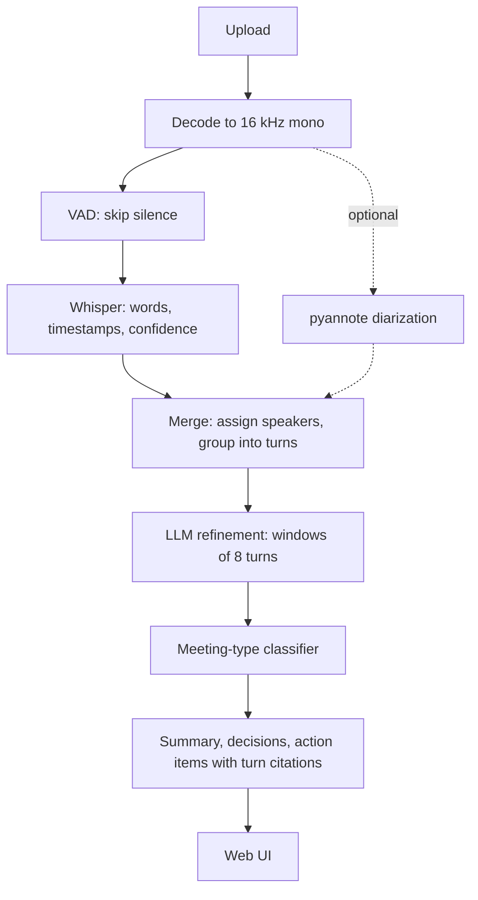

# Recap

**Turn recordings of meetings and casual conversations into a transcript, a summary, and action items you can trace back to the audio.**

Built for the Inter IIT Tech Meet 15.0 ML Bootcamp problem statement: an AI meeting assistant with a speech-to-text stage followed by two LLM stages.

## What it does

- Upload an audio recording (WAV, MP3, M4A, WebM, OGG, FLAC, up to 100 MB).
- Speech is transcribed with word-level timestamps and confidence scores.
- An LLM cleans the transcript (misheard words, punctuation, mixed languages) while the **original text is always kept** next to the cleaned version.
- The conversation is classified as `formal`, `casual` or `brainstorm`, and a summary style is chosen to match.
- A summary, topics, decisions and action items are produced. **Every decision and action item cites the transcript turns it came from**, and citations are verified in code, not just requested in the prompt.
- Accounts, a recordings library, and an audio player where clicking a citation or timestamp jumps to that moment.

## Architecture



### Processing pipeline



| Layer | What it does | Implementation |
|---|---|---|
| Decode | Any audio to 16 kHz mono | `faster-whisper` audio decoder |
| VAD | Drops silence, which also reduces Whisper hallucinations | Silero VAD via `faster-whisper` |
| ASR | Words, timestamps, per-word confidence | `faster-whisper` (default `small`, int8 on CPU) |
| Diarization | Who spoke when, overlap flags | `pyannote.audio` community-1, **optional**, enabled when `HF_TOKEN` is set |
| Merge | Assigns each word to a speaker, groups words into turns | `services/ml/main.py` |
| Refinement | Fixes obvious errors, flags the rest as `[unclear]` | `apps/api/src/services/refine.ts` |
| Classify + summarize | Picks a prompt by meeting type, produces cited output | `apps/api/src/services/summarize.ts` |

## Design decisions

- **Python only where it has to be.** Whisper and pyannote are Python libraries, so audio work lives in a small FastAPI service. Everything else is TypeScript on Bun.
- **Structured JSON between layers.** Each turn carries `speaker`, `start`, `end`, `text`, `confidence` and `overlap`, validated with Zod at the boundary, so a malformed response fails loudly instead of corrupting data.
- **Never lose the raw transcript.** Raw and refined text are stored side by side. A refinement that drops more than 20% of a turn's words is rejected, and an LLM failure still leaves a usable raw transcript.
- **Degrade honestly.** Low-confidence and overlapping speech is flagged as `uncertain` or `[unclear]` instead of being guessed.
- **Citations are checked.** Any cited turn id that does not exist is removed, and items left with no valid citation are dropped.
- **Long inputs.** Transcripts are refined in windows and summarized in chunks, then merged, so length does not hit model limits.
- **Background jobs.** Processing returns `202` immediately, the UI polls for status, and jobs interrupted by a restart are marked `failed` so they can be retried.

## Tech stack

| Part | Tools |
|---|---|
| Web | React, Vite, TypeScript, React Router, TanStack Query |
| API | Bun, Hono, TypeScript, Zod |
| Database | SQLite (`bun:sqlite`) with Drizzle ORM |
| ML service | Python, FastAPI, faster-whisper, optional pyannote.audio |
| LLM | Any OpenAI-compatible chat API (Groq by default) |
| Monorepo | Bun workspaces, shared Zod schemas in `packages/shared` |

## Repository layout

```
apps/
  api/        Bun + Hono API, database, auth, background jobs, LLM stages
  web/        React app (landing page, auth, library, recording detail)
packages/
  shared/     Zod schemas and types shared by the API and the web app
services/
  ml/         Python service: VAD, transcription, optional diarization
```

## Getting started

### Prerequisites

- [Bun](https://bun.sh) 1.x
- Python 3.10 or newer
- An API key for an OpenAI-compatible LLM provider (for example [Groq](https://console.groq.com))

### 1. Install JavaScript dependencies

```bash
bun install
```

### 2. Configure the API

Copy `apps/api/.env.example` to `apps/api/.env` and fill it in:

```
JWT_SECRET=<a random string, 32+ characters>
LLM_API_KEY=<your provider key>
LLM_MODEL=openai/gpt-oss-120b
```

Generate a secret with `bun -e 'console.log(crypto.randomUUID()+crypto.randomUUID())'`. The database and its tables are created automatically on first start.

### 3. Set up the ML service

```bash
cd services/ml
python -m venv .venv
source .venv/Scripts/activate      # Windows (Git Bash)
# source .venv/bin/activate        # macOS / Linux
pip install -r requirements.txt
```

`pyannote.audio` is optional. Remove it from `requirements.txt` for a much lighter install; the service then labels every speaker "Speaker 1".

### 4. Run the three processes

```bash
# terminal 1: ML service (first start downloads the Whisper model)
cd services/ml && source .venv/Scripts/activate && uvicorn main:app --port 8000

# terminal 2: API on http://localhost:3000
bun run dev:api

# terminal 3: web app on http://localhost:5173
bun run dev:web
```

Open http://localhost:5173, create an account, and upload a recording.

On a CPU-only machine, transcription takes roughly as long as the audio. For quick tests, use a faster model and cap the length:

```bash
WHISPER_MODEL=base MAX_AUDIO_SECONDS=180 uvicorn main:app --port 8000
```

## Configuration

| Variable | Used by | Default | Purpose |
|---|---|---|---|
| `JWT_SECRET` | API | required | Signs login tokens (32+ chars) |
| `LLM_API_KEY` | API | required | LLM provider key |
| `LLM_MODEL` | API | `llama-3.3-70b-versatile` | Chat model name |
| `LLM_BASE_URL` | API | Groq OpenAI-compatible URL | Swap providers |
| `ML_URL` | API | `http://localhost:8000` | Where the ML service runs |
| `WEB_ORIGIN` | API | `http://localhost:5173` | Allowed web origin (CORS) |
| `VITE_API_URL` | Web | `http://localhost:3000` | API address used by the browser |
| `WHISPER_MODEL` | ML | `small` | `tiny`, `base`, `small`, `medium`, `large-v3` |
| `WHISPER_DEVICE` / `WHISPER_COMPUTE` | ML | `cpu` / `int8` | Use `cuda` / `float16` with a GPU |
| `MAX_AUDIO_SECONDS` | ML | `0` (no limit) | Transcribe only the first N seconds |
| `HF_TOKEN` | ML | unset | Enables diarization (needs accepting the model terms on Hugging Face) |

## API overview

| Method and path | Purpose |
|---|---|
| `POST /auth/register`, `POST /auth/login` | Create an account, get a token |
| `GET /auth/me`, `PATCH /auth/me` | Read or update the profile |
| `POST /recordings` | Upload audio (multipart: `title`, `file`) |
| `GET /recordings`, `GET /recordings/:id` | List recordings, or get one with turns and summary |
| `GET /recordings/:id/audio` | Stream the audio file |
| `POST /recordings/:id/process` | Run the full pipeline (optional body `{"numSpeakers": 3}`) |
| `POST /recordings/:id/refine` | Re-run only the LLM refinement |
| `POST /recordings/:id/summarize` | Re-run only the classifier and summary |
| `DELETE /recordings/:id` | Delete a recording and its data |

All `/recordings` routes require `Authorization: Bearer <token>` and only ever return the caller's own data.

## Security notes

- Passwords are hashed with argon2id (`Bun.password`); the hash is never returned by the API.
- Uploads are restricted to an allow-list of audio types and a size limit, and files are stored under server-generated names.
- Every recording query is scoped to the logged-in user; another user's recording returns `404`.
- Secrets live in `.env` files that are git-ignored.

## Known limitations

- **Speed.** On CPU, transcription runs at about real time or slower. A GPU, or a hosted speech-to-text service, is the upgrade path (the code already reads `WHISPER_DEVICE`).
- **Overlapping speech.** Several people talking at once remains hard for any open model. Recap flags these stretches instead of hiding them.
- **Speaker labels.** Diarization is optional and off by default. Without it, all speech is attributed to one speaker.
- **Mixed-language speech.** Whisper may transliterate or mis-detect code-switched speech. The refinement stage repairs some of this and marks the rest as uncertain.
- **Single server.** SQLite and local audio storage keep setup simple but do not scale across machines.
- **No automated accuracy benchmark yet.** Quality so far has been checked by listening to test recordings and reading the output.

## Roadmap

- Validate and tune diarization on casual multi-speaker recordings.
- Measure word error rate on a small labelled test set.
- Re-transcribe low-confidence segments with a second pass or a second model.
- Speaker renaming and in-place transcript editing.
- Live recording in the browser.
- Export summaries and transcripts as PDF.

## License

Released under the [MIT License](LICENSE).
